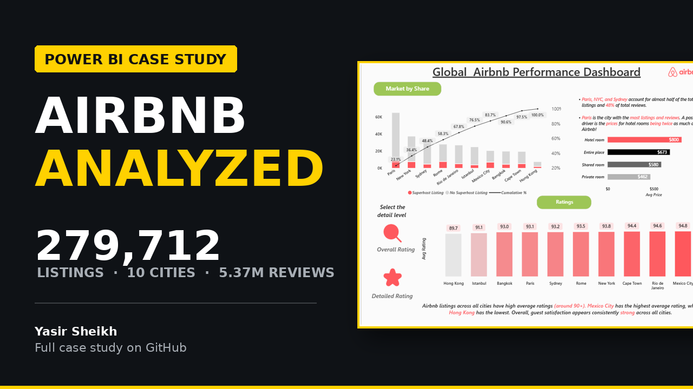
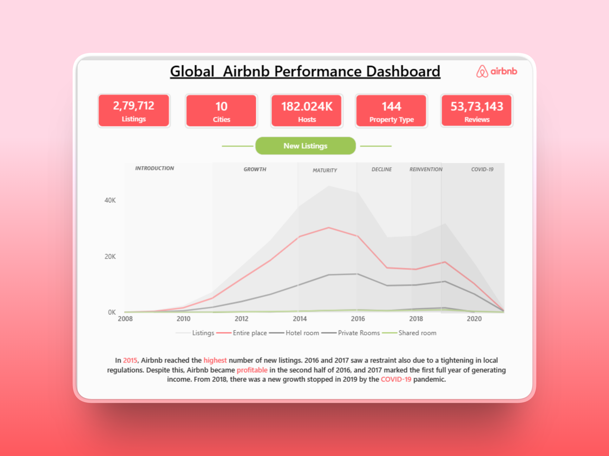
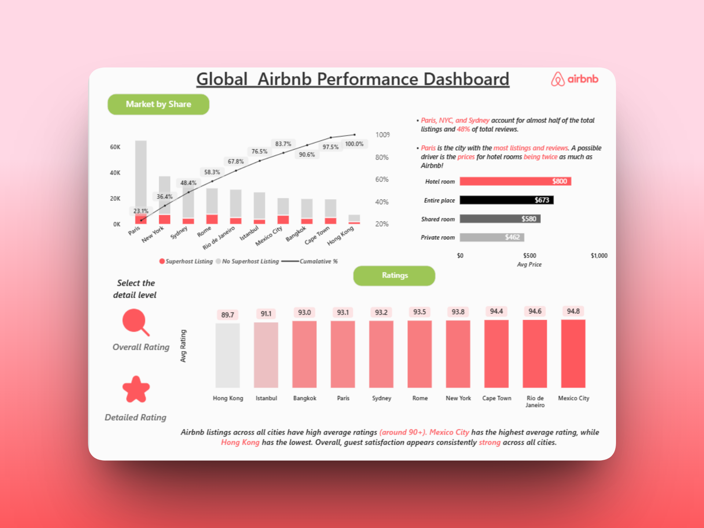

# 🌍 Global Airbnb Market Performance & City Benchmarking Dashboard

[](https://powerbi.microsoft.com/)
[](https://learn.microsoft.com/en-us/dax/)
[]()
[]()

> 📌 **Summary:**
> An end-to-end Power BI analytics project evaluating **279,000+ Airbnb listings**, **182,000+ hosts**, and **5.37 Million guest reviews** across 10 major global cities. It analyzes platform growth lifecycle trends (2008–2021), market concentration, room-type pricing hierarchies, and guest satisfaction benchmarks to inform market expansion and pricing strategy.

---

### 📊 At a Glance (Key Project Metrics)

| 🏡 Total Listings | 👤 Active Hosts | 💬 Total Reviews | 🏙️ Global Cities | 🏨 Property Types |
| :---: | :---: | :---: | :---: | :---: |
| **279,000+** | **182,000+** | **5.37 Million** | **10 Cities** | **144 Types** |

---

## 💡 The Business Problem & Objectives

Market expansion and pricing strategy teams need clear, data-backed answers on **where listing growth is concentrated, how pricing differs across accommodation types, and whether guest satisfaction is consistent** across international markets before committing marketing and host-acquisition budgets.

This project answers three core business questions:
1. **Growth Dynamics:** How did global listing growth evolve from 2008 to 2021 across key lifecycle stages (Growth, Maturity, Reinvention, COVID-19)?
2. **Market Concentration:** Which cities drive the majority of listing and review volume (Pareto analysis)?
3. **Pricing & Quality:** How do room rates compare across categories (Entire place, Hotel room, Private room), and does market size impact guest ratings?

---

## 🖥️ Interactive Dashboard Showcase

### Page 1 — Market Growth & Lifecycle Analysis

*Traces global listing supply from 2008 to 2021 across 6 distinct market lifecycle stages, highlighting peak supply growth in 2015, regulatory impacts (2016–2017), and the COVID-19 downturn.*

### Page 2 — Market Concentration, Pricing & Guest Experience (Ratings Matrix View)

*Demonstrates bookmark navigation toggling to the Ratings view: displays city concentration (Paris, New York, and Sydney leading), room-type pricing hierarchy, and a detailed guest ratings matrix benchmarking performance across cities.*

---

## 🚀 Key Business Insights

- 📈 **Growth Lifecycle Peak (2015):** Listing growth expanded rapidly from 2008 to 2015 before local regulatory tightening (2016–2017) slowed new supply additions.
- 🏛️ **Heavy Market Concentration (Top 3 Cities = 50% Share):** **Paris, New York, and Sydney** account for nearly **50% of all listings** and **48% of total guest reviews**. Paris is the single largest market globally.
- 💵 **Four-Tier Pricing Hierarchy:** 
  - **Hotel Rooms:** Highest average price at **~$800/night**
  - **Entire Place:** **~$673/night**
  - **Shared Rooms:** **~$580/night**
  - **Private Rooms:** **~$462/night**
- 🌟 **Consistently High Guest Satisfaction:** Average ratings across all 10 cities are uniformly strong (ranging from **89.7 in Hong Kong** to **94.8 in Mexico City**), proving service quality remains solid regardless of market size.

---

## 🛠️ Technical Implementation & Power BI Skills

- **Data Modeling & Transformation:** Structured dimension and fact relationships across city, date, room type, and listing metrics.
- **DAX & KPI Development:** Built dynamic measures for cumulative market share %, average room rates, Superhost ratios, and listing growth trends.
- **Bookmark & Navigation UX:** Implemented bookmark-driven view switching ("Market by Share" vs. "Ratings") to dynamically reveal detailed rating breakdowns using a matrix visual without overcrowding the page.
- **Data Visualization Best Practices:** Applied Pareto charts, layered area timelines, and dual-axis visuals to maximize insights without clutter.

---

## 🎯 Actionable Business Recommendations

1. **Focus Host Acquisition on Core Hubs:** Prioritize growth spend in Paris, New York, and Sydney where demand and review activity are already concentrated.
2. **Position Entire Places as Value Alternatives:** In high hotel-cost markets like Paris, market entire apartment listings as cost-effective alternatives to expensive hotel rooms.
3. **Prioritize Volume & Pricing over Quality Interventions:** Since guest satisfaction is high everywhere (>89.7), focus operational resources on supply expansion and revenue management rather than rating fixes.

---

## 📂 Project Structure

```
├── Airbnb Data/               # Raw dataset & data dictionaries (Listings, Reviews)
├── Images/                    # Dashboard preview screenshots & assets
├── pbix File/                 # Power BI report file (.pbix)
└── README.md                  # Project documentation
```

---

## 👤 Author & Contact

**Yasir Sheikh** — *Data Analyst / Business Intelligence Enthusiast*

- 🌐 **GitHub:** [github.com/mohdyasir5155](https://github.com/mohdyasir5155)
- 💼 **LinkedIn:** [linkedin.com/in/mohd-yasir-sheikh](https://www.linkedin.com/in/mohd-yasir-sheikh/)
